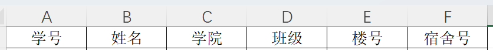

## RemindBot

#### 可解决的问题

- 通过解析excel文件经行核酸提醒
- QQ自动催同学打卡，并@相应同学

#### 使用说明

1. 安装最新版本[node.js](https://nodejs.org/zh-cn/)、

2. 需要在excelList下加入的本班级的核酸表

3. 

4. 下载本代码文件夹

5. 打开终端 切换到项目文件夹根目录

6. 请先使用该命令 `npm config set registry https://registry.npm.taobao.org`

7. 运行`npm i` 安装程序

8. 去`config.js`里面配置您的账号信息

9. 默认使用qq扫码登录，有时间折腾可以使用如下方法：

   [使用密码登录 (滑动验证码教程) · takayama-lily/oicq Wiki (github.com)](https://github.com/takayama-lily/oicq/wiki/01.使用密码登录-(滑动验证码教程))

10. 使用node index.js即可运行服务，在Linux上可安装tmux模块让服务永远在后太运行。

    #### Tips

    - 放在服务器上搭建可以一劳永逸
    - 该项目还有很大的改进空间，比如通过命令来设置不同时间的定时功能
    - 设置定时格式，可以参考[Crontab.guru - The cron schedule expression editor](https://crontab.guru/#00_15_*_*_*)

#### 改写该文件或者添加新功能

1. 程序通过[该模板创建](https://github.com/takayama-lily/oicq-template)
2. 需要的工具：[node.js](https://nodejs.org/zh-cn/)、vscode或者WebStorm(只要能写js就行)
3. 参考文档
    1. https://gitee.com/huchaoran/OICQ/blob/master/docs/api.md
    2. https://oicqjs.github.io/oicq/
